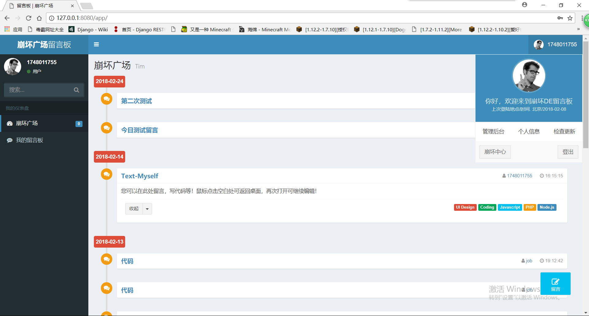
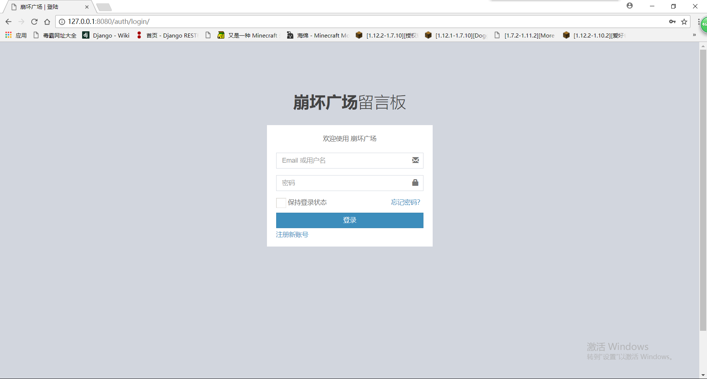
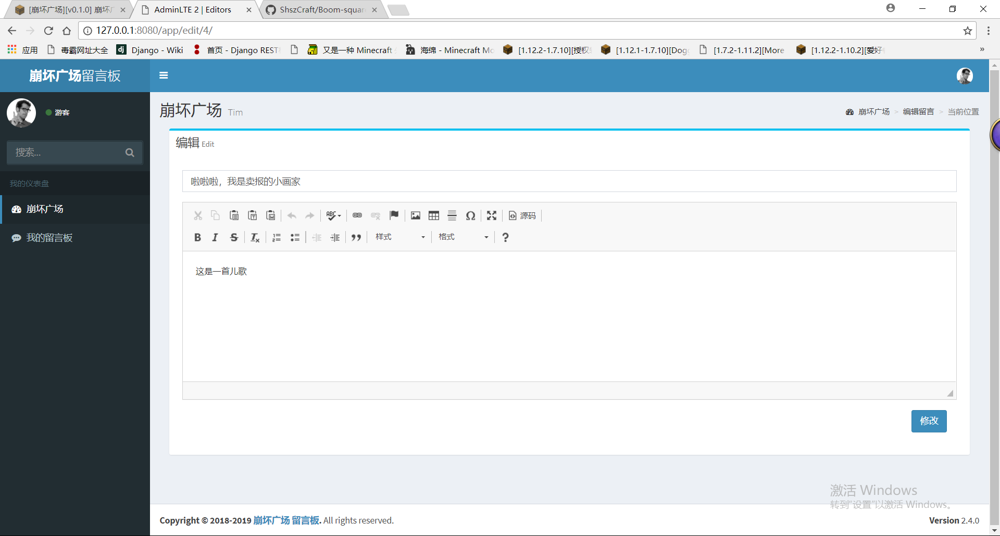
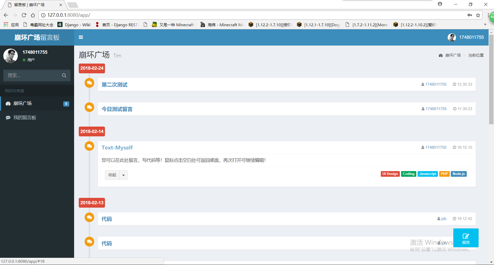
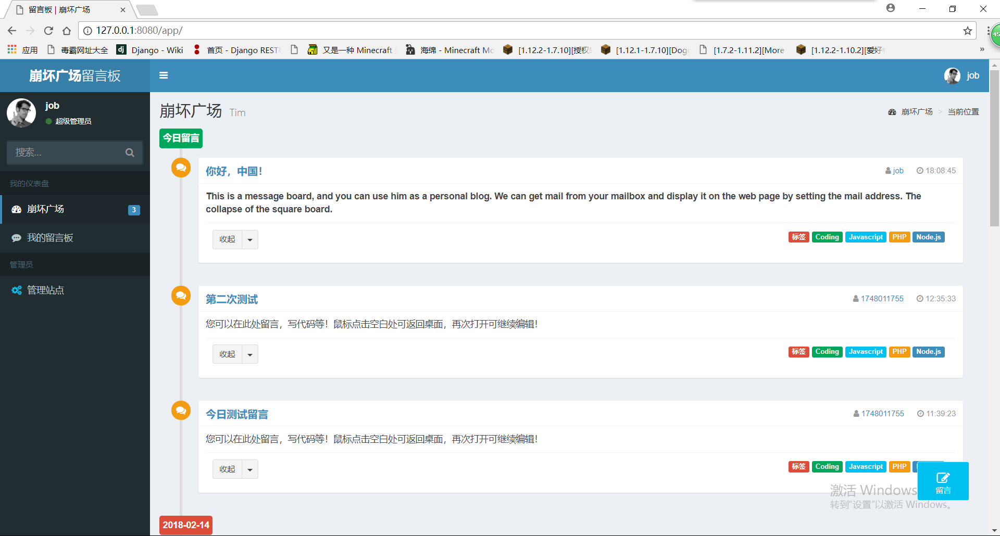
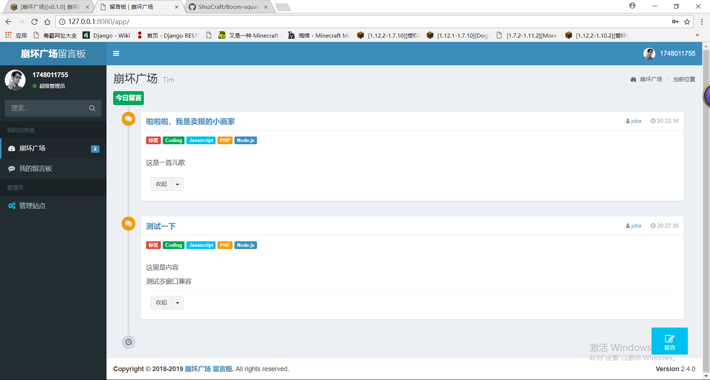
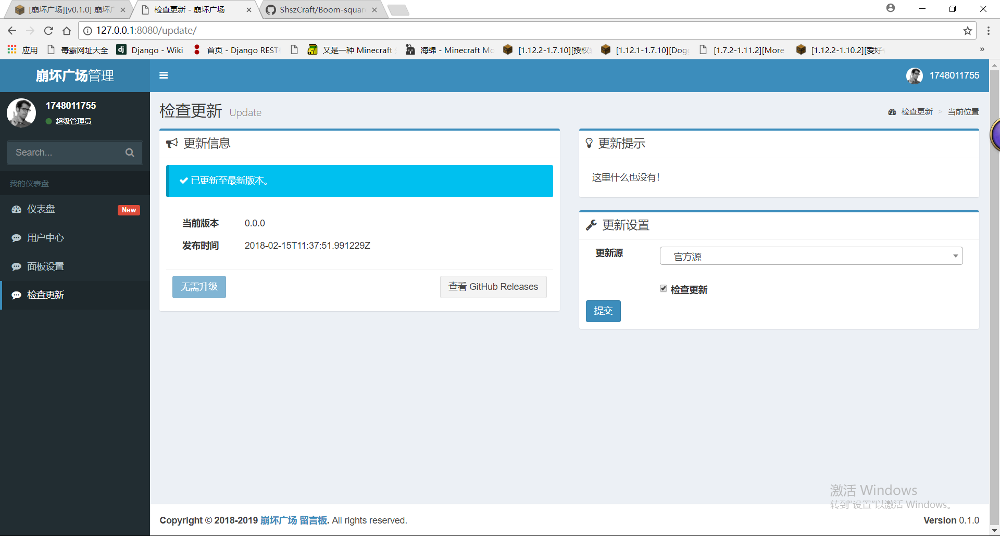
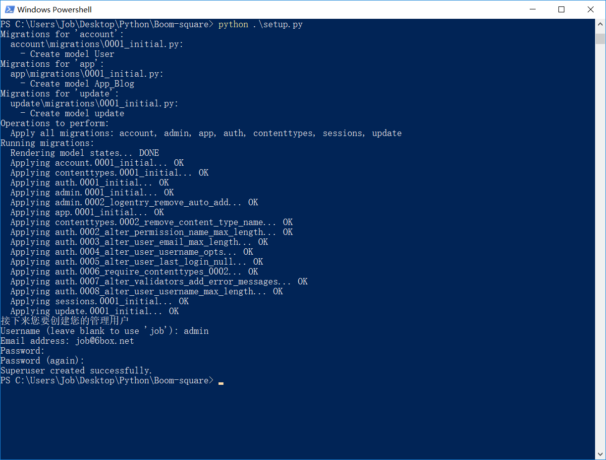

* 简体中文
* [English]()


  
  
**崩坏广场**是一款专为留言板，个人博客等（BoomSquare）打造的WEB站点，通过精心的设计与耐心的研究，配合Markdown强大的排版功能，带来前所未有的书写体验。

<br>

## *☆* 简介

#### **功能丰富** ：

* 支持Markdown语法，支持高亮代码 [√]
* 可只由切换 留言 和博客 模式 [×]
* 支持于皮肤站账号系统对接 [×]
* 支持authme插件对接 [×]
* 更多后续完善


#### **崩坏广场的优点**：

* 专注你的文字内容而不是排版样式，安心写作。
* 随时修改你的文章版本，不必像字处理软件生成若干文件版本导致混乱。
* 可读、直观、学习成本低。
* 统一管理authme账号，实现与登陆插件对接等功能


#### **得心应手** ：

* 简洁高效的编辑器，轻松的导出 HTML、PDF 和本身的 .md 文件, 纯文本内容。
* 兼容所有的文本编辑器与字处理软件；
* 优雅的界面，加上Markdown让你写作更完美

<br>

## *★* 突突突，这里不是图











<br>

## *★* 如何安装崩坏广场？

#### 环境要求

* Python > 3.0 （服务器不支持？）
* 安装如下 **Python** 环境 和 **扩展**：

    * Python > 3.0
    * Django == 1.10
    * Markdown
    * pytz
    * requests

* 提供类似玉Nginx的web服务的 **Python** 扩展 [可选 **建议**]
    * setuptools
    * uwsgi

<br>

## *☆* 快速指南 *安装三步骤*

#### CentOS 7 环境安装

*步骤一: 安装epel源*

    rpm -ivh http://dl.fedoraproject.org/pub/epel/epel-release-latest-7.noarch.rpm
    yum makecache
 
*步骤二: pip工具以及uwsgi 安装*

    yum install python36 wget && wget https://bootstrap.pypa.io/get-pip.py && python3.6 get-pip.py && pip3.6 install Django==1.10 && pip3.6 install uwsgi && pip3.6 install markdown


#### CentOS 6 环境安装

*步骤一: 安装epel源*

    rpm -ivh http://mirrors.ustc.edu.cn/fedora/epel/6/x86_64/epel-release-6-8.noarch.rpm
    yum makecache

*步骤二: pip工具以及uwsgi 安装*

    yum install python36 wget && wget https://bootstrap.pypa.io/get-pip.py && python3.6 get-pip.py && pip3.6 install Django==1.10 && pip3.6 install uwsgi && pip3.6 install markdown


#### Windows 环境安装

*步骤一: Python 环境安装【不需要我教你怎么做吧- 下载 - 双击 - 一路安装】*

    https://www.python.org/ftp/python/3.6.4/python-3.6.4.exe

*步骤二: 然后在cmd窗口输入命令即可*
*打开命令提示符【CMD】会不会？ [不会请百度](https://zhidao.baidu.com/question/189306369.html "不会请百度") <---点击查看方法*
 
    pip3.6 install Django==1.10 && pip3.6 install uwsgi && pip3.6 install markdown


#### 最后是共同部分【*最后一个步骤*】
path为网站安装目录

    python3.6 path/setup.py

*可以制作成启动脚本，就像启动mc一样*
*不分系统和版本，最后的启动方法一样*

    uwsgi --http :8000 --module 你的路径/Boom_square.wsgi

<br>

## *▲* Markdown简介

> Markdown 是一种轻量级的「标记语言」，它的优点很多，目前也被越来越多的写作爱好者，撰稿者广泛使用。看到这里请不要被「标记」、「语言」所迷惑，Markdown 的语法十分简单。常用的标记符号也不超过十个，这种相对于更为复杂的 HTML 标记语言来说，Markdown 可谓是十分轻量的，学习成本也不需要太多，且一旦熟悉这种语法规则，会有一劳永逸的效果。—— [维基百科][1]

正如您在阅读的这份文档，它使用简单的符号标识不同的标题，将某些文字标记为**粗体**或者*斜体*，创建一个[链接][1]。下面列举了几个高级功能，更多语法请百度查看帮助。 


#### 标题

	This is an H1
	=============

	This is an H2
	-------------


#### 链接

链接文字都是用 [方括号] 来标记。

    This is [an example](http://example.com/ "Title") inline link.


#### 图片

    

    


#### 反斜杠
<br>
Markdown 可以利用反斜杠来插入一些在语法中有其它意义的符号

	\   反斜线
	`   反引号
	*   星号
	_   底线
	{}  花括号
	[]  方括号
	()  括弧
	#   井字号
	+   加号
	-   减号
	.   英文句点
	!   惊叹号


#### 代码块

标准Markdown基于缩进代码行或者4个空格位:

``` python
def somefunc(param1=None, param2=0):
    if param1 > param2: # interesting
        print 'Greater'
    return (param2 - param1 + 1) or None
class SomeClass:
    pass

...
```


#### 表格
	| Item      |    Value | Qty  |
	| :-------- | --------:| :--: |
	| Computer  | 1600 USD |  5   |
	| Phone     |   12 USD |  12  |
	| Pipe      |    1 USD | 234  |


#### 引用文本
	> That is pulled out like this from the text my post.

<br>

> **提示：**想了解更多，请查看 **百度百科** [Markdown语法][2]。

<br>

-----

## *☆* 反馈与建议
- Q群：828816138
- 邮箱：vdjango@vip.qq.com


  [1]: https://www.jianshu.com/p/82e730892d42
  [2]: https://www.jianshu.com/p/82e730892d42
